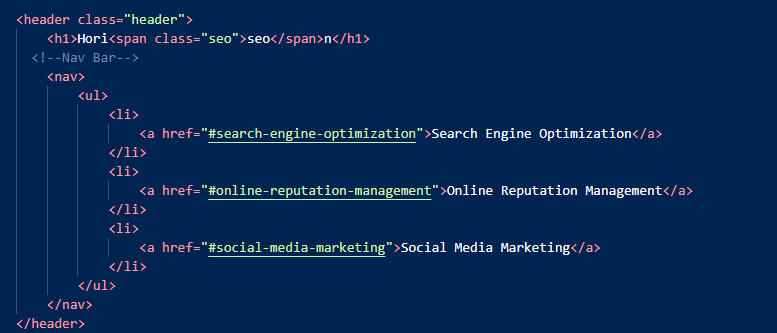
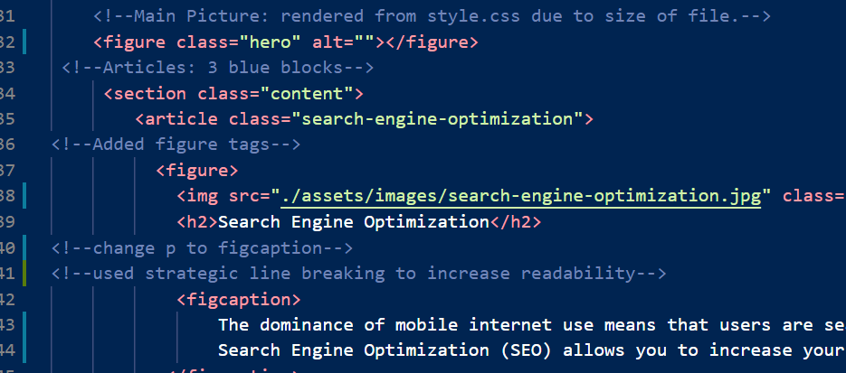
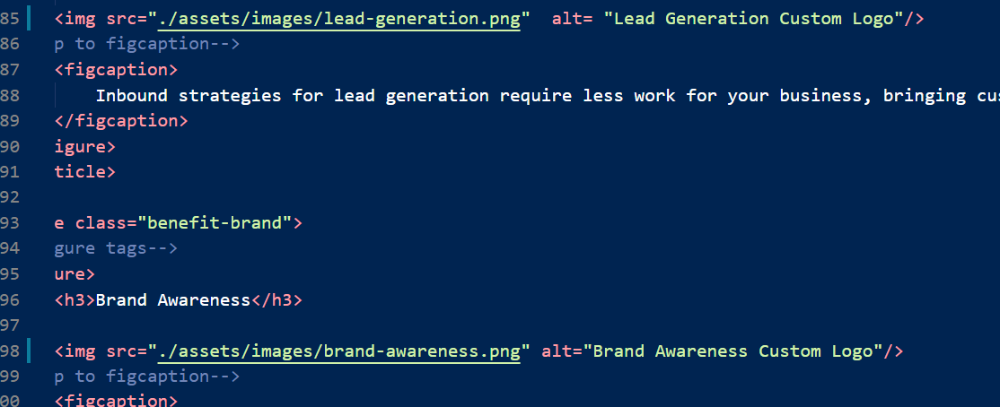
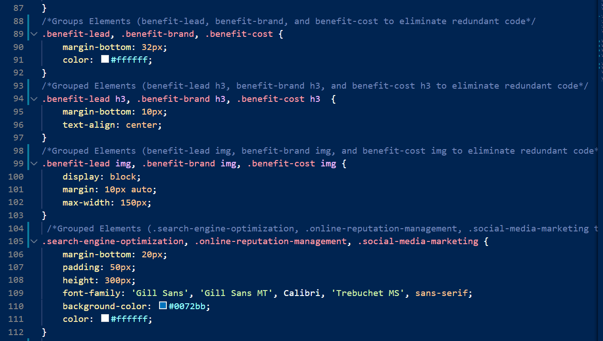

## **Horiseon HTML Refactoring Project**
  </br>

**Objective**
</br>
 We have been contracted by Horiseon to update their HTML to include semantic tags, improve accessibility, and ensure stylesheet flows in accordance with best practices.

</br>

#### **User Story**
```
AS A marketing agency
I WANT a codebase that follows accessibility standards
SO THAT our own site is optimized for search engines
```
</br>

#### **Acceptance Criteria**

</br>

```

*GIVEN a webpage meets accessibility standards*

*WHEN I view the source code*

*THEN I find semantic HTML elements*

*WHEN I view the structure of the HTML elements*

*THEN I find that the elements follow a logical structure independent of styling and positioning*

*WHEN I view the image elements*

*THEN I find accessible alt attributes*

*WHEN I view the heading attributes*

*THEN they fall in sequential order*

*WHEN I view the title element*

*THEN I find a concise, descriptive title*

```

</br>

#### **Updates to index.html**

* Replaced all < div > tags with more decriptive semantic elements
* Added < main > tags to replace < body >.
* Replaced < div > with < header >, updated style.css with appropriate semantic name.
* Replaced < div > with < nav > updated style.css with appropriate semantic name.



* Updated < div > to < article >.
* Updated < div > to < aside >.
* Wrapped images in < figure > tags to assist in future management of code block.
* Replaced < p > tags with < figcaption >.
* Added comments throughout index.html and style.css to document changes and to aid in future maintenence of files.



* Added alt attributes to all images.



* Added strategic line breaks and indentation in code to increase readability.

* Replaced < div > with < footer >.
* Updated the title tags from "website".


* To Horiseon, I've also added a logo to the brower tab.

Code:
```
<head>
    <meta charset="UTF-8" />
    <link rel="stylesheet" href="./assets/css/style.css">
    <!--Added Logo to browser tab-->
    <link rel= "shortcut icon" href="./assets/images/Logo.PNG">
    <title>Horiseon</title>
</head>
```
Output:


#### **Changes to style.css**

* Updated elements to ensure they matched Semantic HTML renaming.
* Removed redundant code blocks through the use of grouping.
