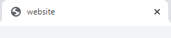
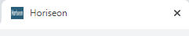

Horiseon HTML Refactoring Project

Objective: We have been contracted by Horiseon to update their HTML to include semantic tags, improve accessibility, and ensure stylesheet flows in accordance with best practices.

CUSTOMER USER STORY
```
AS A marketing agency
I WANT a codebase that follows accessibility standards
SO THAT our own site is optimized for search engines
```

Acceptance Criteria
```

*GIVEN a webpage meets accessibility standards*

*WHEN I view the source code*

*THEN I find semantic HTML elements*

*WHEN I view the structure of the HTML elements*

*THEN I find that the elements follow a logical structure independent of styling and positioning*

*WHEN I view the image elements*

*THEN I find accessible alt attributes*

*WHEN I view the heading attributes*

*THEN they fall in sequential order*

*WHEN I view the title element*

*THEN I find a concise, descriptive title*

```

 Compliance with Acceptance Criteria

 ```
*WHEN I view the source code*
*THEN I find semantic HTML elements*
```
Replaced all < div > tags with more decriptive semantic elements

1. Added main tags to replace body
1. Replaced < div > with < header >, updated style.css with appropriate semantic name
new code:
```    
 <header class="header">
        <h1>Hori<span class="seo">seo</span>n</h1>
      <!--Nav Bar-->
        <nav>
            <ul>
                <li>
                    <a href="#search-engine-optimization">Search Engine Optimization</a>
                </li>
                <li>
                    <a href="#online-reputation-management">Online Reputation Management</a>
                </li>
                <li>
                    <a href="#social-media-marketing">Social Media Marketing</a>
                </li>
            </ul>
        </nav>
    </header>
```
1. Replaced < div > with < nav > 
1. Replaced < div > with < header > and < footer > tags

```
    <footer class="footer">
        <h3>Made with ❤️️ by Horiseon</h3>
        <p>
            &copy; 2019 Horiseon Social Solution Services, Inc.
        </p>
    </footer>
```


*WHEN I view the title element*
*THEN I find a concise, descriptive titleConcise Descriptive title*
I updated the title tags from "website"



To Horiseon, I've also added a logo to the brower tab

Code:

<head>
    <meta charset="UTF-8" />
    <link rel="stylesheet" href="./assets/css/style.css">
    <!--Added Logo to browser tab-->
    <link rel= "shortcut icon" href="./assets/images/Logo.PNG">
    <title>Horiseon</title>
</head>

Output:


